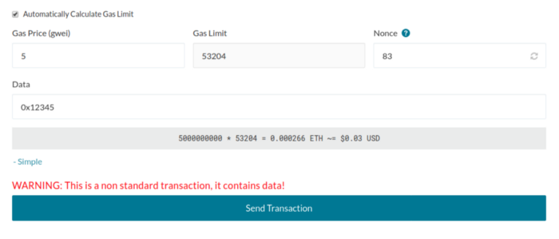
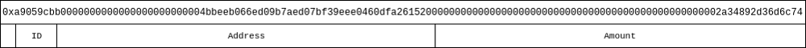
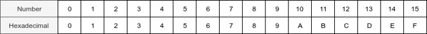
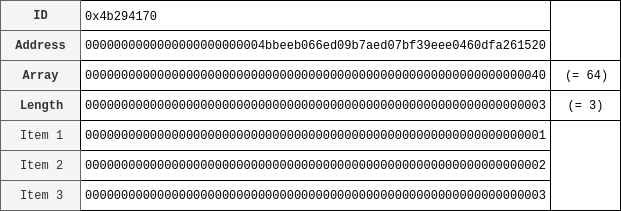
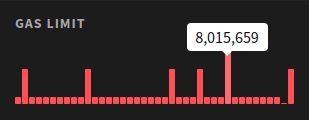

You may have noticed that when interacting with a smart contract (e.g., sending tokens), your transaction automatically contains input data. On MyCrypto, this is simply labeled “Data” - but what does it do? **In this article, you’ll find a technical explanation of transaction input data, including what it is and how it works.**



## What is input data?

Let’s start off by taking a look at [this token transaction](https://etherscan.io/tx/0xa0d13ee62d9013ec0d704abe746e3e0fc1822771b8a039db0926d831971fa157). A person sent zero ETH to [0xd26114cd6ee289accf82350c8d8487fedb8a0c07](https://etherscan.io/address/0xd26114cd6ee289accf82350c8d8487fedb8a0c07) (the OmiseGO contract address), and Etherscan reveals it was a transaction for about 0.19 OMG tokens to [this address](https://etherscan.io/address/0x4bbeeb066ed09b7aed07bf39eee0460dfa261520). So how did the [EVM (Ethereum Virtual Machine)](https://medium.com/mycrypto/the-ethereum-virtual-machine-how-does-it-work-9abac2b7c9e) know that this person wanted to transfer this amount of tokens to another address?

If you look on Etherscan again, you will see that the transaction has input data, which is extra data that you can attach to a transaction. This can be regular text or a number (formatted as a hexadecimal), but in this case the person is using the input data to tell the contract to run a certain function. Contracts are built from a group of functions. For example, an ERC-20 token uses functions like `transfer` and `balanceOf` to transfer tokens from A to B and get the balance for an address, respectively. For the transaction above, you can see on Etherscan that the function `transfer(address _to, uint256 _value)` was called.

The raw input data for the transaction above is `0xa9059cbb0000000000000000000000004bbeeb066ed09b7aed07bf39eee0460dfa26152000000000000000000000000000000000000000000000000002a34892d36d6c74`. You can separate this long hexadecimal value into a few smaller groups. The 0x at the beginning indicates that this will be a hexadecimal value, and the following 8 bytes (a9059cbb) are the function identifier. After that are all the function parameters in groups of exactly 32 bytes (or 64 hexadecimal characters, in this case). So, the first group is `0000000000000000000000004bbeeb066ed09b7aed07bf39eee0460dfa261520`, and the second group is `000000000000000000000000000000000000000000000000002a34892d36d6c74`.



If you look at the formatted input data in Etherscan (the default), you will see the same thing:

```text
Function: transfer(address _to, uint256 _value)
MethodID: 0xa9059cbb
[0]: 0000000000000000000000004bbeeb066ed09b7aed07bf39eee0460dfa261520
[1]: 00000000000000000000000000000000000000000000000002a34892d36d6c74
```

### Hexadeciwhat...?

Hexadecimal is a numeral system, just like decimal and binary numbers, that that uses numbers 0 through 9 and letters A through F (case-insensitive), to represent decimal values between 0–15. In the image below you can see what number corresponds to what hexadecimal value. Hexadecimals are used to write large numbers in a more readable way.



The maximum value for a single hexadecimal is 15, which is 4 bits long. When you put multiple hexadecimals together, you take the binary representation for each individual hexadecimal and combine those to get a decimal number. For example, `0x5c` can be written as `0101` (= `5`) and `1100` (= `C`). Combining these gives us `01011100`, which is the binary number for 92. So the hexadecimal value of `0x5c` is equal to the number 92.

Most programming languages use the `0x` prefix as an arbitrary identifier to separate hexadecimals from other identifiers (like regular decimals, binary numbers, etc.). It does not have any meaning but for the sake of clarity we will include it for every hexadecimal in this article.

With that out of the way, let’s move forward. If you still don’t fully understand hexadecimals, don’t worry - it’s not required to understand what input data is.

## Input data and smart contracts

The primary use case for input data is to interact with smart contracts. Most contracts use the [Contract ABI specification](https://solidity.readthedocs.io/en/develop/abi-spec.html), which allows a website like Etherscan to automatically decode the input data and show the exact action that was called. In our earlier example, it’s a transaction for a token that uses the [ERC-20 standard](https://github.com/ethereum/EIPs/blob/master/EIPS/eip-20.md). This means that we know all the possible functions and their signature. For example, the full signature for the `transfer` function of an ERC-20 contract is always `transfer(address,uint256)`, meaning that it takes an address as the first argument, and an unsigned 256-bit number as the second argument (a number from 0 to 2<sup>256</sup> - 1).

Solidity has a bunch of possible argument types that can be used. If you’re interested in learning more about Solidity and smart contracts, you can find more information about it in the Solidity documentation [here](https://solidity.readthedocs.io/en/develop/abi-spec.html#types).

### The function signature

As we have learned, the function signature for the `transfer` function is `transfer(address,uint256)`. This signature is the same for every ERC-20 contract. If a contract uses different arguments for the transfer function, like an address and a `uint128` (unsigned 128-bit-long integer), the contract is not ERC-20-compliant.

To get the hexadecimal signature for a function, we have to take the first 4 bytes (8 hexadecimal characters) from the [SHA-3 (or Keccak-256)](https://en.wikipedia.org/wiki/SHA-3) hash of this function. To get the Keccak-256 hash of something, you can use the `web3` JavaScript library, or an online tool like [this one](https://emn178.github.io/online-tools/keccak_256.html). If we fill in `transfer(address,uint256)` in this tool, it will show `0xa9059cbb2ab09eb219583f4a59a5d0623ade346d962bcd4e46b11da047c9049b` as the output. If we take the first 8 characters (ignoring the 0x), we get `a9059cbb`, which matches the `MethodID` in the transaction above.

Another example: the function signature for the ERC-20 `approve` function is `approve(address,uint256)`. If we take the SHA-3 hash of this function, we get `0x095ea7b334ae44009aa867bfb386f5c3b4b443ac6f0ee573fa91c4608fbadfba`, and the first 8 characters are `095ea7b3`. Therefore, the input data for an approve transaction will start with `0x095ea7b3`. For example, have a look at this transaction to the DAI token contract [here](https://etherscan.io/tx/0x6e8e85d2b839cc5b199785645c03b423cbf4188dd91896b49413d2ad1832e27d).

### The address and amount

Each argument (except for lists/arrays and strings — we’ll get to that later) has a length of 32 bytes, or 64 hexadecimal characters, but Ethereum addresses are only 40 characters long (without the `0x`). To account for that, the address is padded with zeros. In a hexidecimal string, `0x0000123` is the same as `0x123`, so `0x0000000000000000000000004bbeeb066ed09b7aed07bf39eee0460dfa261520` (address) in the transaction above is the same as `0x4bbeeb066ed09b7aed07bf39eee0460dfa261520`, and `0x00000000000000000000000000000000000000000000000002a34892d36d6c74` is the same as `0x2a34892d36d6c74`. So why use all the zeros then?

As we learned earlier, the maximum number in a Solidity contract is 2<sup>256</sup> - 1, which fits in exactly 32 bytes. Using a fixed length also makes it easier for the EVM and other applications to decode the data, since you can assume that each group always has the same length.

### So, what about arrays and strings?

As mentioned in the previous section, the input data for arrays and strings works a little bit differently. An array is basically a list of items. For example, a list of 1, 2, and 3 would be written as `[1, 2, 3]` in most programming languages. To send this data in a transaction, each individual item in the list is sent as 32-byte group and listed at the end of the input data. A pointer to the length of the array is used as the argument.

For example, let’s say we have a function called `myFunction` that takes an address and array of numbers (`myFunction(address,uint256[])`). The function signature for this function is `0x4b294170`. For the address, we’ll use the same address as above. Because our array has 3 items, the length of the array as a hexadecimal is `0x3`. We know that each argument takes exactly 32 bytes of space, and the array is put after all other arguments, so the array starts at 32 + 32 = 64 bytes.

The input data for this transaction will be: `0x4b2941700000000000000000000000004bbeeb066ed09b7aed07bf39eee0460dfa26152000000000000000000000000000000000000000000000000000000000000000400000000000000000000000000000000000000000000000000000000000000003000000000000000000000000000000000000000000000000000000000000000100000000000000000000000000000000000000000000000000000000000000020000000000000000000000000000000000000000000000000000000000000003`



Because strings can have an arbitrary length (longer than 32 bytes), they are separated into groups of 32 bytes and treated the same as arrays in the input data.

## How does a site like Etherscan decode the input data?

A hash is a one-way function, so if you have the function signature hash, it’s not possible to get the function signature from that hash (unless you brute force it). Contract owners can upload the contract ABI as [JSON](https://solidity.readthedocs.io/en/develop/abi-spec.html#json), [like this one here](https://api.etherscan.io/api?module=contract&action=getabi&address=0xfc668AE14b0F7702c04b105448fE733D96C558DF), which can be used to get the function signature hashes.

Even if the contract owner did not upload the contract ABI, it is possible to decode input data for many contracts. As you learned earlier in this article, the signatures for ERC-20 contract functions are always the same, allowing Etherscan to simply use a pre-defined contract ABI for those contracts. For example, the contract ABI for the `transfer` function of an ERC-20 contract looks like this:

```json
{
  "constant": false,
  "inputs": [
    {
      "name": "_to",
      "type": "address"
    },
    {
      "name": "_value",
      "type": "uint256"
    }
  ],
  "name": "transfer",
  "outputs": [
    {
      "name": "",
      "type": "bool"
    }
  ],
  "payable": false,
  "stateMutability": "nonpayable",
  "type": "function"
}
```

If the input data signature matches with one of the pre-defined functions, Etherscan can decode the input data.

## Is there a limit to the input data?

Yes and no. Ethereum does not have a fixed limit for the length of the input data, but the input data does consume gas. The maximum amount of gas in a single block fluctuates, but is about 8 million at the time of writing. Every 0-byte (`0x00`) consumes 4 gas and every non-0-byte consumes 68 gas. The gas cost for a standard transaction is 21,000 units of gas, so not taking any contract execution into account, the maximum length for the input data right now is about 2 megabytes of zeros, or about 0.12 megabytes for only non-zeros. Since the input data is not likely to have just zeros or non-zeros, the actual limit is somewhere in between and depends on the input data.

If you want to see the actual block gas limit, you can use [ETHStats.net](https://ethstats.net/).



Simply hover over one of the blocks under the “Gas Limit” section to see the most recent gas limit.

## References

- [Ethereum: A secure decentralised generalised transaction ledger. (G. Wood, 2014)](https://ethereum.github.io/yellowpaper/paper.pdfhttps://ethereum.github.io/yellowpaper/paper.pdf)
- [The Solidity documentation.](https://solidity.readthedocs.io/)
