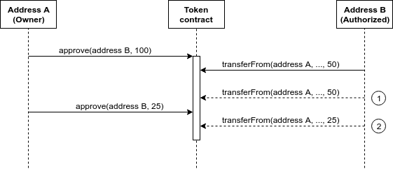

User experience in the Ethereum ecosystem is becoming better and better. Most of the time when interacting with a token, you don’t even notice any difference, even though the technology behind Ethereum tokens is very different from Ether itself.

**But what are tokens and how do they work?**

In this article, you’ll find a comprehensive, technical comparison of common token standards like ERC-20 and ERC-721, but also some of the lesser-known standards like ERC-777.


## What is a token?

> A token is a digital asset that exists on a blockchain but is not the main cryptocurrency of that blockchain.

Tokens work similarly to Ether — you can store them in your wallet, send them to other addresses, etc. — but the difference is that a token doesn’t have its own blockchain. Tokens make use of existing blockchains and are usually developed for a specific application. Coins like Ether and Bitcoin, on the other hand, can be used for a wide range of applications.

We can distinguish between two types of tokens:

* **Security tokens**: tokens that represent a level of investment in a project. When you invest in a security token, you expect to make a profit out of it.
* **Utility tokens**: tokens that are used to interact with a product or service.

A good example of a utility token is [Golem](https://golem.network/). Golem lets you share unused computing power in exchange for Golem Network Tokens (GNT).

### Tokens under the hood

Since tokens don’t have their own blockchains, they make use of smart contracts under the hood. Smart contracts allow you to execute any arbitrary code on the Ethereum Virtual Machine (EVM). If you’re interested in learning more about smart contracts and the EVM, check out this article:

<Embed title="The Ethereum Virtual Machine — How does it work?"
       description="Diving into Ethereum’s decentralized ecosystem for building"
       url="https://medium.com/mycrypto/the-ethereum-virtual-machine-how-does-it-work-9abac2b7c9e"
       image="https://miro.medium.com/max/1400/1*g7klT0GZnEwX9Z-zCofyuA.png" />

Every token available on the Ethereum blockchain has its own smart contract. Each smart contract keeps track of the token owners for that specific token. Since the EVM itself doesn’t know what tokens are, token transactions have a value of 0 ETH. Instead, the destination address and amount of tokens are specified in the _input data_, which you can read more about [here](/posts/why-do-we-need-transaction-data). The transaction itself is sent to the token contract.

[](https://etherscan.io/tx/0xa3e2fc7ca6a3fd8071f6b23c6a4f70eb87eaa0dbb278cff722707e9fe2d63c16)

Notice how the destination address is the DAI contract, but the tokens were actually transferred to 0x66aa…1621. The actual address the tokens were sent to was specified in the [transaction input data](/posts/why-do-we-need-transaction-data). The `transfer` function for the contract was called, specifying the target address and the number of tokens to send. The balance for each address is stored in the contract itself and updated when a function like `transfer` is called, and the contract _state_ is updated and stored in the next block.

Let’s imagine the first address (A) has a balance of 25 tokens and the second address (B) doesn’t have any tokens yet. The owner of address A wants to send all his tokens to address B, which he does by sending a transaction to the contract with `transfer(address B, 25)` as input data.


The transaction is included in the next block (7593651). Address A now has a balance of 0 DAI and address B, which was previously not present in the contract, now has a balance of 25 DAI. The new contract state is stored in the block and you can query the contract directly to get the balance for an address. Etherscan has a nice feature for this, called “Read Contract.”


The response is the number of tokens including its decimals. To get the actual balance, you can multiply this number by 10<sup>-n</sup> where n is the number of decimals used by the token: 1000000000000000036 x 10<sup>-18</sup> ≈ 1 DAI. Most tokens use 18 decimals. We’ll go into detail about tokens and decimals later in this article.

### How are tokens created?

Token creation, also called _minting_, is done by deploying a new smart contract to the Ethereum blockchain. Tokens can be distributed in multiple ways, but a common method is to do a token sale, also known as an Initial Coin Offering (ICO). Basically, it’s crowdfunding for coins or tokens.

Some contracts have a `mint` function that allows the owner of the contract to create new tokens. Here’s a very simple implementation:

```solidity
function mint(address _to, uint256 _amount) public {
  require(msg.sender == owner);
  balances[_to] += amount;
  supply += amount;

  emit Transfer(address(0), _to, _amount);
}
```

When `msg.sender` (the address that calls the function) is equal to the owner of the contract, the set number of tokens will be sent to the address specified. In the case of an ICO, a similar `mint` function could be used, but instead of manually having to specify the amount, `msg.value` (the amount of ETH sent in the transaction) is used to calculate how many tokens someone gets.

Tokens can also be destroyed. This process is called _burning_ and can be done in multiple ways as well, including:

* Reducing the actual number of tokens in circulation (thus reducing the `totalSupply` of the token). Some tokens have a `burn` function built in to do this.
* Sending the tokens to an address like [0x0000000000000000000000000000000000000000](https://etherscan.io/address/0x0000000000000000000000000000000000000000). While it’s theoretically possible that someone generates the private key for this address, the chance is extremely small (1 in 16<sup>40</sup>). Many tokens prevent sending from and/or to this address, however.

If you are a developer looking to build your own token on the Ethereum blockchain, I recommend you check out [OpenZeppelin’s ERC-20 or ERC-721 implementations](https://github.com/OpenZeppelin/openzeppelin-solidity), or [0xjac’s ERC-777 implementation](https://github.com/0xjac/ERC777) as reference. Even though I try to explain everything about these standards in detail as best as I can, some things in this article may be incorrect, incomplete, or outdated. This article exists purely for educational reasons. **You shouldn’t use anything in this article as a reference for your own token implementation.**

---

## The ERC-20 Standard

When we talk about a token in the context of Ethereum, we usually mean an ERC-20 token. ERC-20 is currently the most used token standard. There are over 100,000 ERC-20-based tokens on the Ethereum network currently, and almost all Ethereum wallets and wallet interfaces support them. Thanks to standards like ERC-20, wallet (interface) developers only need to implement support once, and all the ERC-20-based tokens will work.

To understand what ERC-20 is, it’s important to know what an ERC is first. ERC stands for Ethereum Request for Comment. An ERC starts off as an EIP, Ethereum Improvement Proposal. When an EIP is approved, it will become a new ERC. The ERC-20 standard can be found [here](https://eips.ethereum.org/EIPS/eip-20).

Below you’ll find the ERC-20 _interface_, a set of functions and events that an ERC-20 smart contract must implement.

```solidity
pragma solidity ^0.5.7;

interface ERC20 {
  function totalSupply() external view returns (uint256);

  function balanceOf(address who) external view returns (uint256);
  function transfer(address to, uint256 value) external returns (bool);

  function approve(address spender, uint256 value) external returns (bool);
  function allowance(address owner, address spender) external view returns (uint256);
  function transferFrom(address from, address to, uint256 value) external returns (bool);

  event Transfer(address indexed from, address indexed to, uint256 value);
  event Approval(address indexed owner, address indexed spender, uint256 value);
}
```

Wallet interfaces, exchanges, or other dApps (decentralised applications) using tokens can use these functions to provide support for all ERC-20-compliant tokens.

ERC-20 has some optional functions as well, such as to get the name, symbol, and number of decimals the token uses.

```solidity
function name() public view returns (string)

function symbol() public view returns (string)

function decimals() public view returns (uint8)
```

[MyCrypto](https://mycrypto.com/) and other applications like [MetaMask](https://metamask.io/) and [Etherscan](https://etherscan.io/) use these functions to get the metadata for a token.

As explained earlier in this article, ERC-20 transfers are relatively simple. The transfer function is called and the tokens are moved to the receiving address. ERC-20 has two ways to transfer tokens:

* You can use the `transfer` function to send tokens from your address to another address.
* You can use the `transferFrom` function to send tokens from a different address to another address when you’re authorised to do so. We’ll get back to that in a bit.

### Decimals

In one of the earlier versions of MyCrypto, when you added a token, you had to manually specify the number of decimals the token uses. When you look up a token contract on Etherscan, you’ll see the number of decimals as well:


This number is important because the EVM does not know how to deal with decimal numbers: only full numbers are used. This includes regular transactions and token transactions. Instead, a full number with all the decimal numbers behind it is used. For example, if you have 3.14159 DAI and we assume DAI has 5 decimals (to make it easier), the balance stored in the smart contract is 314159. Multiply this with 10<sup>-5</sup> and you get your actual balance again.

This doesn’t just apply to tokens; Ether is stored in the same way, with the smallest unit being 1 Wei. Since Ether has a maximum of 18 decimals (1 Wei = 0.000000000000000001 ETH), most tokens use this number as well.

### Approving transactions and allowance

You may have noticed that when you interact with dApps like [Compound](https://medium.com/mycrypto/learning-about-supplying-borrowing-with-compound-a2ca4eef7d6c), or most decentralised exchanges, you have to send a transaction to approve spending a specific token first. When you do this, you allow the contract of the dApp to send tokens on your behalf. Without it, it would be significantly harder or even impossible to interact with ERC-20 tokens for dApps.

This is done by calling the `approve` method of the token. You specify the address of the spender (the dApp contract), and the value the spender can spend. Most dApps specify the maximum 256-bit number value (2<sup>256</sup> -1), basically allowing them to spend an infinite number of tokens on your behalf.

Most (if not all) token implementations use a simple mapping to store the allowance.

```solidity
mapping (address => mapping (address => uint256)) private _allowed;
```

You can see this as a list of lists. A similar [JSON](https://en.wikipedia.org/wiki/JSON) notation would be:

```json
{
  "allowed": {
    "0x4bbeEB066eD09B7AEd07bF39EEe0460DFa261520": {
      "0x3FDA67f7583380E67ef93072294a7fAc882FD7E7": 100000
    }
  }
}
```

Here 0x4bbe…1520 allows 0x3FDA…D7E7 (Compound) to spend 100.000 of this specific token. Compound (or any other allowed smart contract) can then use ERC-20’s `transferFrom` method to transfer tokens from 0x4bbe…1520.

### ETH as an ERC-20 Token

ERC-20 was developed after the creation of Ethereum (obviously), so ETH itself is not ERC-20 compliant. This can make it harder for smart contracts to interact with ETH and tokens at the same time, for example, when trading a token for Ether on a decentralized exchange (DEX). That’s why we have [Wrapper Ether](https://weth.io/) (wETH), developed by [Radar Relay](https://radarrelay.com/). WETH is an ERC-20 compliant token, with a value of exactly 1 ETH per token. You can always deposit or withdraw your ETH for wETH and vice-versa. It always maintains a one-to-one peg with ETH.

To wrap your ETH, you can simply send it to the [contract address](https://etherscan.io/address/0xc02aaa39b223fe8d0a0e5c4f27ead9083c756cc2), and to withdraw it, you can call the `withdraw` method of the contract. Usually, dApps have a way to wrap and unwrap your ETH built in to the interface to make it easier.

### The problems of ERC-20

While ERC-20 has helped the adoption of Ethereum and Ethereum-based tokens massively, it does have some problems.

First off, it’s possible to send tokens to a contract that doesn’t support tokens. Since sending tokens involves sending a call to the token contract, most (non-token) contracts are not made to send or receive tokens, meaning that the tokens simply get stuck in the contract forever. Currently, [there’s about 28,000 DAI in the DAI token contract](https://etherscan.io/token/0x89d24a6b4ccb1b6faa2625fe562bdd9a23260359?a=0x89d24a6b4ccb1b6faa2625fe562bdd9a23260359) that cannot be moved.

Secondly, contracts are not notified of a token transaction when using `transfer`. Since the balance is updated in a contract internally, there’s no way for a third-party contract to tell if a transaction happened. There is a workaround for this, but it involves using `approve` to authorize the third-party contract and using `transferFrom` in that contract. This means you need to send two transactions for a single token transfer.

Lastly, there is an issue where an authorized address could potentially transfer tokens from the owner’s address twice, as described [here](https://docs.google.com/document/d/1YLPtQxZu1UAvO9cZ1O2RPXBbT0mooh4DYKjA_jp-RLM). This is caused by a possible race condition, where the authorized address could transfer tokens just before the owner changes the allowance.



1. Address A authorized address B to spend 100 tokens.
2. Address B sends 50 tokens from address A to another address.
3. Address A decides to lower the maximum limit for Address B to 25.
4. Address B notices this, and tries to send a transaction to spend 50 tokens (1). If this transaction is completed before the transaction of Address A, Address B can spend another 25 tokens (2) for a total of 125.

You could say that this isn’t really a problem with ERC-20 since most dApps ask you to authorize spending an infinite number of tokens anyway, but it’s still something to be aware of.

There are some other token standards like ERC-223 and ERC-777 that try to solve these problems. We’ll go into detail about these standards later in this article.

---

## Non-Fungible Tokens a.k.a. ERC-721


Another common standard is [ERC-721](https://github.com/ethereum/EIPs/blob/master/EIPS/eip-721.md), a token standard for Non-Fungible Tokens (NFTs), most commonly known for collectibles like [CryptoKitties](https://www.cryptokitties.co/). It’s not a replacement for ERC-20, but more of an addition. The difference between ERC-20 and ERC-721 is that ERC-721 tokens are unique, or as the name suggests, _non-fungible_. They can’t be copied or replaced with another ERC-721 token.

Lets continue to use [CryptoKitties](https://www.cryptokitties.co/) as an example. Each CryptoKitty is a unique token and has its own properties, like type, color, traits, etc. Since these properties are different for each CryptoKitty, you cannot replace one for another. One DAI token, on the other hand, can be replaced with another DAI token since they are all the same.

Gaming and collectibles are just a few applications of ERC-721 tokens, but they can be used for many things, including ownership of physical objects that are “unique.” Here are some examples:

* Licensing
* (Digital) art
* Real estate

The ERC-721 standard defines multiple interfaces, but below you’ll find the main ERC-721 interface.

```solidity
pragma solidity ^0.5.7;

interface ERC721 is ERC165 {
  function balanceOf(address _owner) external view returns (uint256);
  function ownerOf(uint256 _tokenId) external view returns (address);

  function safeTransferFrom(address _from, address _to, uint256 _tokenId, bytes data) external payable;
  function safeTransferFrom(address _from, address _to, uint256 _tokenId) external payable;
  function transferFrom(address _from, address _to, uint256 _tokenId) external payable;

  function approve(address _approved, uint256 _tokenId) external payable;
  function setApprovalForAll(address _operator, bool _approved) external;
  function getApproved(uint256 _tokenId) external view returns (address);
  function isApprovedForAll(address _owner, address _operator) external view returns (bool);

  event Transfer(address indexed _from, address indexed _to, uint256 indexed _tokenId);
  event Approval(address indexed _owner, address indexed _approved, uint256 indexed _tokenId);
  event ApprovalForAll(address indexed _owner, address indexed _operator, bool _approved);
}

interface ERC165 {
  function supportsInterface(bytes4 interfaceID) external view returns (bool);
}
```

At first glance, ERC-721 may appear similar to ERC-20. One of the big differences is the use of the `tokenId` parameter. Since each NFT is unique, each has its own token identifier, used to represent an individual token.

_Note: “NFT” and “ERC-721 token” are used interchangeably here._

Another big difference is `safeTransferFrom`, which is a safety measure of the ERC-721 standard, more specifically, the `ERC721TokenReceiver` interface. It checks if the target address is a smart contract and will try to call the `onERC721Received` function if that’s the case. This function (if it exists) must return `0xf0b9e5ba`, which is equal to `bytes4(keccak256("onERC721Received(address,uint256,bytes)"))`. If it doesn’t return this exact value or if the function does not exist, the contract will throw an error and the transaction will be reverted. This prevents anyone from accidentally sending their NFTs to a smart contract that doesn’t support them. The `transferFrom` function won’t check if the target address is capable of receiving ERC-721 tokens and should not be used unless the caller (the smart contract calling the function or person sending the transaction) explicitly checks this before transferring.

ERC-721 contracts must also implement [ERC-165](https://github.com/ethereum/EIPs/blob/master/EIPS/eip-165.md), a standard used to detect what interfaces a smart contract implements. Each interface/standard has an identifier and the `supportsInterface` function can be queried to see if the contract implements that specific interface ID. We won’t go into much detail on ERC-165 in this article, but if you’re interested and want to learn more about it, I suggest you check it out [here](https://github.com/ethereum/EIPs/blob/master/EIPS/eip-165.md).

ERC-721 contracts also have the `approve` function just like ERC-20. It can be used to approve transferring a single token (specified by the token ID). That’s why there’s also the `setApprovalForAll` function, which would allow the operator to send all tokens owned by the address.

### How NFTs Are Stored Internally

_This explanation is based on the ERC-721 implementation by OpenZeppelin, found [here](https://github.com/OpenZeppelin/openzeppelin-solidity/blob/master/contracts/token/ERC721/ERC721.sol)._

In a simple ERC-20 contract, tokens are stored in a mapping, with the address and the balance. Since every individual NFT has it’s own properties, storing NFTs in a smart contract is not as simple as keeping a list of the number of NFTs per address. As mentioned above, each NFT has it’s own token ID, so a smart contract needs to keep track of all the token IDs and their respective owners.


The easiest way to accomplish this is to use a mapping, which maps the token ID to the address of the owner.

```solidity
mapping (uint256 => address) private _tokenOwner;
```

Since the ERC-721 standard has a function to get the number of NFTs for an address (`balanceOf`), a second mapping can be used to keep track of that.

```solidity
mapping (address => uint256) private _ownedTokensCount;
```

Alternatively, the contract could go over all the token IDs in the first mapping and check if the address is the address being queried. The problem with this is that loading an item from a mapping consumes gas. Even though this mapping is primarily used for querying (which doesn’t consume gas), it’s still not possible to go over the block gas limit when querying a smart contract.

Transferring a token works by calling `safeTransferFrom` (or `transferFrom`), after which both mappings are updated.


The token with ID 1 is transferred to the address 0xabcd…1234, so this address now owns 2 tokens.

### Creating NFTs and storing token metadata

When an ERC-20 token is being minted, we can simply increase the total supply and add the tokens to an address. For ERC-721 tokens, however, we need to keep track of the token metadata somehow. In the case of CryptoKitties, that includes things like the breed, colour, etc.

Storing data on the blockchain is expensive. If you read [my previous article on transaction input data](/posts/why-do-we-need-transaction-data), you may know that every non-zero byte of data consumes 68 units of gas, _just to send it to the blockchain without storing it_. That means sending a file of 100 kB (e.g. a small image) to the blockchain, costs about 6,800,000 units of gas. Assuming a gas price of 5 Gwei, that would cost you about 0.034 Ether, or about $5.78 at the time of writing, **for one image**, and again, that’s without even storing the image on the blockchain. That’s why developers often look at alternatives for storing data in a secure, decentralised way instead.

ERC-721 does define a method for storing token metadata, but this method is not a requirement. Developers are free to implement their own mechanisms. It uses [URIs](https://en.wikipedia.org/wiki/Uniform_Resource_Identifier) (Uniform Resource Identifiers) which reference a JSON file, which conforms to the “ERC-721 Metadata JSON Schema”.

```json
{
  "title": "Asset Metadata",
  "type": "object",
  "properties": {
    "name": {
      "type": "string",
      "description": "Identifies the asset to which this NFT represents"
    },
    "description": {
      "type": "string",
      "description": "Describes the asset to which this NFT represents"
    },
    "image": {
      "type": "string",
      "description": "A URI pointing to a resource with mime type image/* representing the asset to which this NFT represents. Consider making any images at a width between 320 and 1080 pixels and aspect ratio between 1.91:1 and 4:5 inclusive."
    }
  }
}
```

As you may see, this schema is not very flexible. Some token developers choose to use [IPFS](https://ipfs.io/) (InterPlanetary File System), a decentralized protocol to share files. Then the IPFS hash can be stored in the token metadata.

When the `mint` function is called (e.g. when a new CryptoKittie is born), the URI or IPFS hash of the file with the metadata is specified and saved in the contract.

---

## Other Token Standards (ERC-223, ERC-777)

ERC-223 and ERC-777 are alternative token standards, based on ERC-20. ERC-223 is not finalized yet, but ERC-777 was finalized on May 6th, 2019. It’s not as popular yet as ERC-20, but my expectation is that it will eventually become more popular than ERC-20. If you’re a developer working on a new token, definitely check out ERC-777.

ERC-223 and ERC-777 both aim to solve the same problems of the ERC-20 standard, but they use different approaches. In this article, we’ll go into further detail of the ERC-777 standard.

### What is ERC-777?

ERC-777 is a relatively new token standard, developed by [Jacques Dafflon](https://twitter.com/0xjac) and [Jordi Baylina](https://twitter.com/jbaylina) ([Giveth](https://giveth.io/)), and is similar to ERC-20. In fact, an ERC-777 contract can be compatible with ERC-20, meaning that it can implement all the functions specified by ERC-20. This allows compatibility with existing wallets and other applications, but those applications are not able to use all the new features of ERC-777. A pure ERC-777 token contract isn’t compatible with ERC-20, but the standard does describe how to make a contract compatible.

Just like ERC-721, ERC-777 defines a set of interfaces, below you’ll find the main token interface.

```solidity
pragma solidity ^0.5.7;

interface ERC777 {
  function name() external view returns (string memory);
  function symbol() external view returns (string memory);
  function totalSupply() external view returns (uint256);
  function granularity() external view returns (uint256);

  function balanceOf(address owner) external view returns (uint256);
  function send(address to, uint256 amount, bytes calldata data) external;

  function defaultOperators() external view returns (address[] memory);
  function isOperatorFor(address operator, address tokenHolder) external view returns (bool);
  function authorizeOperator(address operator) external;
  function revokeOperator(address operator) external;
  function operatorSend(
    address from,
    address to,
    uint256 amount,
    bytes calldata data,
    bytes calldata operatorData
  ) external;

  function burn(uint256 amount, bytes calldata data) external;
  function operatorBurn(address from, uint256 amount, bytes calldata data, bytes calldata operatorData) external;

  event Sent(
    address indexed operator,
    address indexed from,
    address indexed to,
    uint256 amount,
    bytes data,
    bytes operatorData
  );
  event Minted(address indexed operator, address indexed to, uint256 amount, bytes data, bytes operatorData);
  event Burned(address indexed operator, address indexed from, uint256 amount, bytes data, bytes operatorData);
  event AuthorizedOperator(address indexed operator, address indexed tokenHolder);
  event RevokedOperator(address indexed operator, address indexed tokenHolder);
}
```

Here you’ll see some similar functions as in the ERC-20 standard again. The big differences between ERC-20 and ERC-777 are operators and hooks, which I’ll explain in the next two sections.

### Operators

Operators are ERC-777’s replacement for ERC-20’s allowance. Instead of allowing an address to send a specific number of tokens, you can authorize and revoke operators, which can send tokens on your behalf.

ERC-777 defines two types of operators:

* Default operators
* Address-specific operators

Default operators are authorised to send transactions, burn tokens, etc. for all addresses, while address-specific operators have to be authorised on a per-address level, as the name suggests. This is done by calling the `authorizeOperator` function with the operator’s address.

This can be used by dApps like decentralised exchanges (DEX) to allow tokens to be traded. The DEX contract would be the operator for the user’s address. Internally, operators can be stored with a mapping in a mapping (or a list in a list) again:

```solidity
mapping(address => mapping(address => bool)) internal _authorizedOperator;
```

This way the values in the mapping can be queried efficiently, without consuming too much gas.

ERC-777 has the `operatorSend` function as a replacement for ERC-20’s `transferFrom` function. Just like `transferFrom`, it checks if the `msg.sender` (the caller of the function) is an operator for the `from` address and will simply revert if that’s not the case.

### ERC-1820 and hooks

[ERC-1820](https://eips.ethereum.org/EIPS/eip-1820) is the standard for a Pseudo-introspection Registry Contract.

> This standard defines a universal registry smart contract where any address (contract or regular account) can register which interface it supports and which smart contract is responsible for its implementation.

This allows for ERC-777 contracts to use _hooks_. Hooks can be used by other smart contracts and regular addresses to run a function before sending and/or receiving tokens. ERC-777 contracts can call the `getInterfaceImplementer` function of the public ERC-1820 registry ([0x1820a4B7618BdE71Dce8cdc73aAB6C95905faD24](https://etherscan.io/address/0x1820a4b7618bde71dce8cdc73aab6c95905fad24)) with the address of the receiver, and the hash of the specific interface to get the implementation of a specific hook.

```solidity
function getInterfaceImplementer(address _addr, bytes32 _interfaceHash) external view returns (address);
```

ERC-777 defines two hooks: `tokensToSend` and `tokensReceived`. The first hook is called when sending tokens, and the second one is called when receiving tokens.

```solidity
pragma solidity ^0.5.7;

interface ERC777TokensSender {
  function tokensToSend(
    address operator,
    address from,
    address to,
    uint256 amount,
    bytes calldata userData,
    bytes calldata operatorData
  ) external;
}
```

```solidity
pragma solidity ^0.5.7;

interface ERC777TokensRecipient {
  function tokensReceived(
    address operator,
    address from,
    address to,
    uint256 amount,
    bytes calldata data,
    bytes calldata operatorData
  ) external;
}
```

If the receiver address does have an implementation (smart contract) for the interfaces, the ERC-777 contract will run the function. If the function throws an error, the transaction is reverted.

As mentioned, even regular addresses (not smart contracts) can set an implementation for this interface. Since regular addresses cannot have any code themselves, they can use a separate smart contract as their implementation. This works by calling the `setInterfaceImplementer` function of the ERC-1820 registry.

```solidity
function setInterfaceImplementer(address _addr, bytes32 _interfaceHash, address _implementer) external;
```

The flow for an ERC-777 transaction is quite complicated, so here’s an image to make it a bit more clear.


1. The sender calls `send(to, amount, data)` with the receiver’s address, amount, and (optional) data.
2. The token contract calls `getInterfaceImplementer(address, interfaceHash)`, with the address of the sender and the interface hash of `ERC777TokensSender`.
3. If an implementation is specified, the token contract calls `tokensToSend(operator, from, to, amount, userData, operatorData)` on the implementing contract.
4. The token contract calls `getInterfaceImplementer(address, interfaceHash)` again, with the address of the receiver and the interface hash of `ERC777TokensRecipient`.
5. If an implementation is specified, the token contract calls `tokensReceived(operator, from, to, amount, data, operatorData)` on the implementing contract.

For simplicity’s sake, in the diagram we assume that the sender and receiver is a contract that implements the hook function. If the sender or receiver doesn’t implement the hook itself, and they do have an implementation for their specific hook, a call to the implementing smart contract is made instead.

The `tokensReceived` hook is also used to prevent accidentally sending tokens to a non-supported smart contract. Per specification of ERC-777, if the recipient is a contract, it must implement the `ERC777TokensRecipient` interface. Transactions to smart contracts that don’t implement this interface and aren’t registered in the ERC-1820 registry are simply reverted.

---

## The future of tokens

Right now, ERC-20 is by far the most popular token standard. ERC-223 is relatively old compared to ERC-777, and although the latter has some improved features over ERC-223, it was only recently finalized and hasn’t gained much popularity yet. Since ERC-777 token contracts can be compatible with ERC-20, my expectation is that it will eventually become the standard for most (fungible) tokens.

ERC-721 is in a similar situation as ERC-20. While it’s growing in popularity, there are some alternative ERCs that try to improve or replace ERC-721, like [ERC-875](https://eips.ethereum.org/EIPS/eip-875) and [ERC-998](https://eips.ethereum.org/EIPS/eip-998). These ERCs are still a proposal and only time will tell if (one of) these ERCs will replace ERC-721.

---

## References

* [The Ethereum Virtual Machine — How does it work?](https://medium.com/mycrypto/the-ethereum-virtual-machine-how-does-it-work-9abac2b7c9e)
* [Why do we need transaction data?](/posts/why-do-we-need-transaction-data)
* [ERC-20 Token Standard](https://eips.ethereum.org/EIPS/eip-20)
* [ERC-223 Token Standard](https://github.com/ethereum/EIPs/issues/223)
* [ERC-721 Non-Fungible Token Standard](https://eips.ethereum.org/EIPS/eip-721)
* [ERC-777 Token Standard](https://eips.ethereum.org/EIPS/eip-777)
* [ERC-1820 Pseudo-introspection Registry Contract](https://eips.ethereum.org/EIPS/eip-1820)
