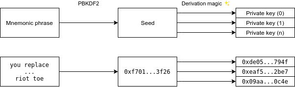
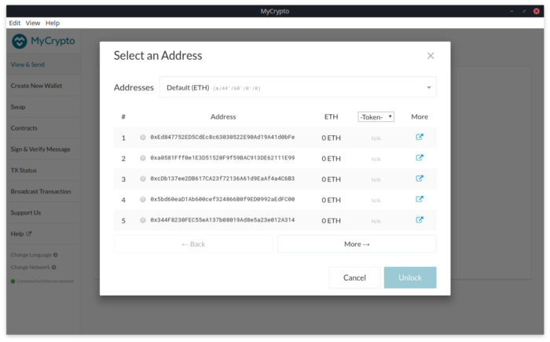
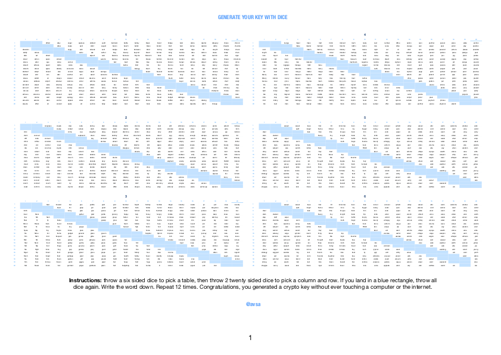
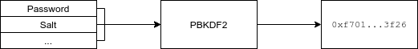
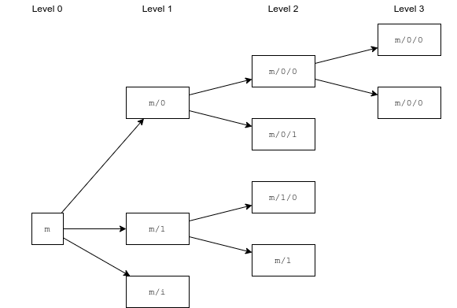
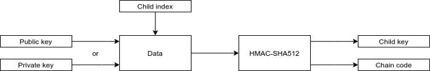
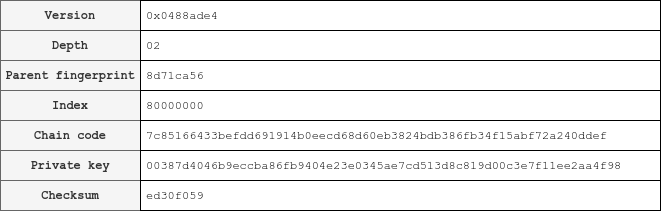

Mnemonic phrases may seem very simple at first glance: You enter your mnemonic phrase on MyCrypto, click a few buttons and you get an address. Under the hood, there are a lot of steps to go from that mnemonic phrase to the resulting address. In this article, we’ll take an in-depth look at mnemonic phrases, the process to get from a mnemonic phrase to an address, and everything else that happens behind the scenes when you use a mnemonic phrase or hardware wallet.

Let’s start with an example. To keep it simple for now, we’ll just assume that addresses are derived by an index number (0, 1, 2, 3…). Here’s what it looks like:



First, we hash the mnemonic phrase to get a seed. Then, the seed is used in a mathematical formula and we get a private key. Each of these steps will be described in detail below.

Note: This article is for educational purposes only. Please do not use it as reference for your own projects.

---

## How mnemonic phrases are created

Mnemonic phrases are defined by the [BIP-39 specification](https://github.com/bitcoin/bips/blob/master/bip-0039.mediawiki). This is the most common type of mnemonic phrase used in the ecosystem, and does not rely on some kind of knowledge from yourself to be generated (like a ["brain wallet"](https://github.com/ethereum/wiki/wiki/Brain-Wallet)). BIP-39 will be explained in more detail further on in this article.

The creation of mnemonic phrases starts by generating [initial entropy](<https://en.wikipedia.org/wiki/Entropy_(computing)>). There are a few different definitions of entropy, but in this case, it’s referring to _randomness_ collected by a computer. Essentially, it’s a random sequence of bits (zeroes and ones), generated with the purpose of being used for cryptography. That means that entropy must be sufficiently random to be secure. In general, more entropy means that something is more secure, [but 128 bits of entropy is considered enough](https://security.stackexchange.com/a/102163).

For the creation of a mnemonic phrase, we need at least 128 bits of entropy, and at most 256 bits. Depending on the length of the initial entropy, the mnemonic phrase will be 12 to 24 words long.

Let’s say we want to create a 12-word-long mnemonic phrase. We start off by generating 128 bits of entropy.

```
11111011 00010101 11111100 00011110 01000100 00011011 10110100
00110001 01000000 01111010 01010111 11101011 10000111 11111010
00011111 11011110
```

We then take the first `entropy length / 32 bits` of the [SHA-256 hash](https://en.wikipedia.org/wiki/SHA-2) of the entropy. So, in our case, we take `128 / 32 = 4` bits, which results in `0100`. This is the _checksum_ for our mnemonic phrase. Then, we append the checksum to the entropy, resulting in 132 bits (128 bits of entropy and 4 bits of the checksum). We split the 132 bits into groups of 11 bits, which looks like this:

```
11111011000 10101111111 00000111100 10001000001 10111011010
2008        1407        60          1089        1498

00011000101 00000001111 01001010111 11101011100 00111111110
197         15          599         1884        510

10000111111 10111100100
1087        1508
```

Below each bit sequence is the decimal representation of the binary number. These numbers are important because this is what we use to find the corresponding word in the wordlist. BIP-39 specifies a few different wordlists in different languages (e.g. English, Chinese, Spanish). Each wordlist contains exactly 2048 words (0 to 2047).

In this case, we will be using the English wordlist, but there are other wordlists too, like Chinese and Spanish. If we look up each word in the wordlist with the decimal numbers, here is our final mnemonic phrase:

```
2008     1407     60       1089     1498     197      15
wild     quiz     always   market   robust   board    acid

599      1884     510      1087     1508
enough   twist    divert   margin   route
```

We can enter this mnemonic phrase into MyCrypto’s desktop application, and we get a list of addresses back:



We successfully created a secure mnemonic phrase from scratch! But what if you don’t want to use plain, boring words? Well, [you can use emoji too](https://gist.github.com/bartekn/c877987b722ec792912d720921a7418c)...

### Checksum

As mentioned above, we append a _checksum_ to the mnemonic phrase. The checksum is used to verify that the mnemonic phrase is valid. By reversing the process of creating the mnemonic phrase, it’s possible to calculate the checksum based on the first 11 (or 23) words:

1. Search for the word in the wordlist, and write down the index.
2. Get the binary representation of the indices, and add it all together, to get the initial entropy.
3. Re-calculate the SHA-256 hash of the entropy and take the first 4 or 8 bits, depending on the length of the entropy.
4. Use the result to calculate the new mnemonic phrase, and check if the last word matches.

### Generating entropy using dice rolls

If you want to generate entropy completely offline, without the use of a computer, you can use dice instead. [Alex Van de Sande](https://twitter.com/avsa) made a very useful image which can help you to create a mnemonic phrase.

> I made this handy image that allows you to see all BIP39 words arranged in a way you can print in an A4, pick them using a few dice by throwing it 11 times (the last word is a checksum).
>
> Inspired by this post: https://t.co/NrPQyS4avZ by @blocknative pic.twitter.com/TuMCbGn4y8
>
> [](https://drive.google.com/file/d/1u9ZdUCMOMGAjg8_ftpiQcuB1tzdtFrx5/view)
>
> — [Alex Van de Sande (avsa.eth) (@avsa) May 22, 2019](https://twitter.com/avsa/status/1131281684635234304)

After getting the first 11 words, you can use the steps described above to get the last, checksum word. Of course this also works with 24-word-long mnemonic phrases.

---

## From mnemonic phrase to seed to private key

The process of getting private keys from a mnemonic phrase involves a few steps. These steps are described in a couple different BIPs, Bitcoin Improvement Proposals.

### BIP-39: Mnemonic code for generating deterministic keys

In order to get the actual private key, the mnemonic phrase is first turned into a _seed_. MyCrypto follows the [BIP-39 specification](https://github.com/bitcoin/bips/blob/master/bip-0039.mediawiki) for this, just like most other wallets and/or interfaces. Even though the specification was made for Bitcoin, it can be applied to Ethereum and other networks as well. BIP-39 defines a few wordlists in some common languages, like English, Chinese, and Spanish. This does not mean that you can take any combination of words from the wordlist, though. The last (12th or 24th) word is used as a checksum word.

The keys generated are [_deterministic_](https://en.wikipedia.org/wiki/Deterministic_system). That means that there is no randomness involved to generate a key from a mnemonic phrase. As long as the input (mnemonic phrase) is the same, the output (seed) will also be the same.

The seed is derived from the mnemonic phrase using [Password-Based Key Derivation Function 2](https://en.wikipedia.org/wiki/PBKDF2), also known as PBKDF2. A key derivation function like PBKDF2 takes some input parameters, and gives a cryptographic key back. As long as the input parameters are the same, the derived key is also the same. PBKDF2 has 5 input parameters: a pseudorandom function (1), password (2), a salt (3), a number of iterations (4), and a key length (5).



Most important here are the password and the salt. For the password, we use the mnemonic phrase itself. For the salt, "mnemonic" combined with the optional passphrase (not to be confused with the password input) is used. If our mnemonic phrase is "lamp deliver advance friend...," and our optional passphrase is "hunter2", the key is derived using `PBKDF2("wild quiz always market...", "mnemonichunter2", ...)`. If you don’t use a passphrase, only "mnemonic" is used as salt.

The result is a 512-bit-long seed:

<pre>
<code wrap={true}>
0x77cdf1d92225adc0e67b1b4f5a31820251d518b3af074df25a07b751947fd07ebd29a4d0e57b84ea9de03a9123e2a6ea1e3ed739d4c562efec21f1bb0a54a879
</code>
</pre>

We use this seed in the next step to generate a BIP-32 master key.

---

### BIP-32: Hierarchical Deterministic Wallets

The seed is used to get a master key for a _hierarchical deterministic wallet_ (or HD wallet). For that, we use [BIP-32](https://github.com/bitcoin/bips/blob/master/bip-0032.mediawiki) (and [BIP-44](https://github.com/bitcoin/bips/blob/master/bip-0044.mediawiki)). BIP-32 defines hierarchical deterministic wallets and BIP-44 defines a specific BIP-32 hierarchy to use.

An HD wallet starts off with a master key `m`. The master key can be derived from the seed, again using PBKDF2. Instead of using “mnemonic” as salt, we use “Bitcoin seed” (remember: BIP-32 is originally designed for Bitcoin). That means we can derive a master key with `PBKDF2("0x77cd...a879", "Bitcoin seed")`. Again, this results in a 512-bit long key, in this case:

<pre>
<code wrap={true}>
0x300b155f751964276c0536230bd9b16fe7a86533c3cbaa7575e8d0431dbedf23f9945bb8b052bd0b0802c10c7c852e7765b69b61ce7233d9fe5a35ab108ca3b6
</code>
</pre>

From this key, we can derive many different child keys. Each extended key (including the master key) has 2<sup>31</sup> normal child keys and 2<sup>31</sup> hardened child keys. BIP-32 does not specify a maximum number of levels, so (theoretically) you can derive an infinite number of keys from a single master key.



Each of those child keys has an index, where normal child keys use indices 0 through 2<sup>31</sup>-1 and hardened keys use 2<sup>31</sup> through 2<sup>32</sup>-1. To make notation easier, BIP-32 uses i' (or i<sub>h</sub>) notation for hardened indices.

Normal child keys are calculated using the public key of the parent, whereas hardened child keys are calculated using the private key of the parent. That means that **you cannot derive a hardened child key without a private key**.

### Extended keys

The first 256 bits of the master key we generated earlier are used as the private key, and the last 256 bits are used as _chain code_. To prevent child keys from being solely dependent on the private keys, the chain code is used as extra entropy for generating child keys. The private key and chain code combined make for an _extended_ private key.

Similar to the extended private key, we also have an extended public key. The public key (K<sub>pub</sub>) can be derived from the private key (K<sub>priv</sub>), using [elliptic curve point addition](https://en.wikipedia.org/wiki/Elliptic_curve_point_multiplication#Point_addition). Basically, you take a point on the elliptic curve based on the private key, and multiply it with the pre-defined point `G`:

<pre>
<code>
K<sub>pub</sub> = K<sub>priv</sub> × G
</code>
</pre>

Bitcoin uses secp256k1's elliptic curve. Because G is a pre-defined constant point on the elliptic curve, the resulting public key will always be the same.


The actual math beyond this goes way beyond my knowledge, so we won’t go into depth on that. If you’re interested in learning more about elliptic curve cryptography, I recommend [An Introduction to Bitcoin, Elliptic Curves and the Mathematics of ECDSA](https://github.com/bellaj/Blockchain/blob/6bffb47afae6a2a70903a26d215484cf8ff03859/ecdsa_bitcoin.pdf) by N. Mistry.

### Deriving child keys

Let's say we want to derive the child key at `m/0/0'`. This process has two steps: first, derive `m/0` (0 to `m`), and then derive `m/0/0'` (0' to 0) from that. For example, if we have a function to derive a child private key CKD<sub>priv</sub>, we have to use:

<pre>
<code>
CKD<sub>priv</sub>(CKD<sub>priv</sub>(m, 0), 0')
</code>
</pre>

to derive `m/0/0'`. Derivation for each child key looks a bit like this:



First, we have to determine whether a child key is hardened or not.

- If the child key is hardened, take the 32-byte-long **private key** and append a zero byte (`0x00`) to the start, to make it 33 bytes long.
- If the child key is not hardened, we take the 33-byte-long **public key**.

We'll call this the data. Next, append the index, (`0` or `0'` in this case), to the data. Then we have to hash the data using HMAC-SHA512. HMAC is similar to PBKDF2 in that it produces a deterministic hash. HMAC is unique in that you need a cryptographic key as well. For that, we use the chain code part of the extended key.

We split the result of the hash into two groups of 32 bytes. The first group is used to calculate the new private key or public key, and the second group is the new chain code for the derived child key. To calculate the new key, we use a simple formula:

<pre>
<code>
k<sub>i</sub> = (I<sub>l</sub> + K<sub>par</sub>) % n
</code>
</pre>

The new key (`kᵢ`) is calculated by taking the first 32 bytes (`Iₗ`) and adding the parent key (`kₚₐᵣ`). We take the modulo of this sum over `n` ([_modular arithmetic_](https://en.wikipedia.org/wiki/Modular_arithmetic)), and we get the new private key. `n` is a pre-defined constant variable of secp256k1.

Note that this only works if we have access to the private key. In situations where only a public key is available (e.g., when deriving a key from a hardware wallet), deriving a child key works a bit differently:

<pre>
<code>
k<sub>i</sub> = point(I<sub>l</sub>) + K<sub>par</sub>
</code>
</pre>

Here we calculate the point at `Iₗ` on the elliptic curve of secp256k1 and add the parent key to that point, using elliptic curve multiplication. The result is the new public key (`kᵢ`).

With the new key and chain code, we can calculate the extended private or public key again.

### Extended key serialization

The extended key can be serialized to a [Base58](https://en.wikipedia.org/wiki/Base58) string, to make it "human-readable". The serialized extended private key for the master key we generated earlier looks like this:

<pre>
<code wrap={true}>
xprv9s21ZrQH143K4YUcKrp6cVxQaX59ZFkN6MFdeZjt8CHVYNs55xxQSvZpHWfojWMv6zgjmzopCyWPSFAnV4RU33J4pwCcnhsB4R4mPEnTsMC
</code>
</pre>

And the public key:

<pre>
<code wrap={true}>
xpub661MyMwAqRbcH2Z5RtM6ydu98YudxiUDTaBESx9VgXpURBCDdWGezitJ8ormADG6CsJPs23fLmaeLp8RJgNvFo6YJkGhpXnHusCkRhGZdqr
</code>
</pre>

Let's have a look at the extended private key, to see what it’s made of. As hexadecimal, it looks like this:

<pre>
<code wrap={true}>
0x0488ade4000000000000000000f9945bb8b052bd0b0802c10c7c852e7765b69b61ce7233d9fe5a35ab108ca3b600300b155f751964276c0536230bd9b16fe7a86533c3cbaa7575e8d0431dbedf232204691b
</code>
</pre>

The extended key is 82 bytes long, and consists of:

- **The version** (4 bytes). This is either `0x0488b21e` (xpub) or `0x0488ade4` (xpriv). Because of these version bytes, the Base58 encoded key will always start with "xpub" or "xpriv".
- **The depth** (1 byte). Since this is the master key, the depth is 0 (`0x00`). A child key would have depth 1 (`0x01`), the child key of that child key depth 2 (`0x02`), and so on.
- **The parent fingerprint** (4 bytes). This is an identifier for the extended key. Since this is the master key (which doesn't have a parent key), the fingerprint is always `0x00000000`. For child keys, this is calculated by taking the [RIPEMD160](https://en.wikipedia.org/wiki/RIPEMD) hash of the SHA256 hash of the public key.
- **The index** (4 bytes). Since this is the master key, the child index is 0 (`0x00000000`). For child keys, this is simply the number that was used to derive the key. For example, in the case of m/1, the index of the first child is 1 (`0x00000001`).
- **The chain code** (32 bytes).
- **The public or private key** (33 bytes). Because the private key itself is only 32 bytes long, we append a byte (`0x00`) to it. Public keys are already 33 bytes long.
- **The checksum** (4 bytes). Extended keys contain a 4-byte checksum to make sure that the extended key is valid. This is simply the SHA256 hash of the SHA256 hash of the other bytes.

Let's look at another example. If we derive `m/0/0'` from the master key, we get:

<pre>
<code wrap={true}>
xprv9wpaeBFtdQRvLmeHJW8am7sYUSJJyup2rJwhCzZQG6KZCB5mqWDpSTamzJZAgtAhJVmaoRSMTeRyzmXXt28tvrZQnnr576LpNcDaSjf4fPn
</code>
</pre>

Or as hexadecimal:

<pre>
<code wrap={true}>
0x0488ade4028d71ca56800000007c85166433befdd691914b0eecd68d60eb3824bdb386fb34f15abf72a240ddef00387d4046b9eccba86fb9404e23e0345ae7cd513d8c819d00c3e7f11ee2aa4f98ed30f059
</code>
</pre>

And here are all the individual fields. Keep in mind that the example child index is hardened, so the index is (0+) 2<sup>31</sup> or `0x80000000`.



### From public key to address

This is the last step in the process. For Ethereum, to get the address from a public key, first we hash the public key with Keccak256. The last 20 bytes of this hash are the address.

The Keccak256 hash of our public key for `m/0/0'` is:

<pre>
<code wrap={true}>
0x4f6a21d5fef845c915263c2fb0008238486b99b112adb319b4fec15dda83437d
</code>
</pre>

If we take the last 20 bytes, and apply an [EIP-55](https://github.com/ethereum/EIPs/blob/master/EIPS/eip-55.md) checksum, we finally get our address: `0xB0008238486B99b112aDb319B4fEC15DDa83437d`.

---

## BIP-44: Multi-Account Hierarchy for Deterministic Wallets

[BIP-44](https://github.com/bitcoin/bips/blob/master/bip-0044.mediawiki) defines an implementation of BIP-32 and [BIP-43](https://github.com/bitcoin/bips/blob/master/bip-0043.mediawiki), and is what most applications use nowadays. While BIP-32 isn’t very strict on the implementation and the different levels to use, BIP-44 defines 5 levels in the BIP-32 path:

```
m / purpose' / coin_type' / account' / change / address_index
```

This is also known as a derivation path, and is what we use to choose a specific address derived from a seed. Some examples are:

- The first address (_address_index_ = 0) of the "default" Ethereum derivation path: `m/44'/60'/0'/0/0`
- The third address (_account_ = 2) of the derivation path used by Ledger Live: `m/44'/60'/2'/0/0`

### Purpose

The purpose field is introduced by BIP-43. It indicates what specification is used for a derivation path. In the case of BIP-44 derivation paths, the purpose is always 44', indicating that the derivation path is following BIP-44. Some wallets use a derivation path like `m/44'/60'/0'/0`, which is technically not a valid BIP-44 path, and a different purpose _should_ be used.

### Coin type

The coin type is used to differentiate coins from each other. Ethereum uses 60', whereas Bitcoin uses 0' for example. These coin types are defined in [SLIP-44](https://github.com/satoshilabs/slips/blob/master/slip-0044.md), an improvement proposal by Satoshi Labs, the inventors of Trezor.

### Account

The account field can be used to differentiate accounts, or "user identities" from each other. Some wallets (e.g., Ledger Live) use this field instead of the account index to give the user more privacy. Because this level is hardened, the private key is needed to derive other accounts from the parent level.

### Change

The change field can have two values: either zero or one. Zero means that the address is used for an "external" chain, and one is used for an "internal" chain. For Bitcoin, this can be used to differentiate change addresses (1) from regular addresses (0), but for Ethereum, this is usually set to zero, as there are no change addresses.

### Address index

The address index is what most wallets use to derive different addresses from an HD wallet. In MyCrypto for example, the different addresses in the address list are indexed with this field.

---

## Hardware wallets and key derivation


So far, we have mostly talked about derivation in the context of mnemonic phrases. This assumes we have access to a master seed, usually generated from a mnemonic phrase. In the case of hardware wallets, the master seed is secured, and there’s no way to access it with software.

Hardware wallets like Ledger and Trezor devices solve this with a few possibilities:

- We can request a single address from the device by specifying the full derivation path.
- We can generate an extended _public_ key by requesting the public key and chain code for a derivation path.

The first option is very straightforward, we can request a single address by specifying which derivation path to get the address for. If we want to get multiple addresses from the device though, this option has a downside: Requesting an address from the device takes some time, so it takes longer to fetch multiple addresses. In tools like [FindETH](https://github.com/FindETH/web) (an Ethereum address search tool that I made a while ago) this causes a problem, as it takes significantly longer to search for addresses.

To solve this, we can use the second option. We request the public key and chain code from the device, for the derivation path we want, and for the level above it, since we need that to generate the parent fingerprint. With this information, we can calculate the extended public key.

Let's say we want to derive multiple addresses using `m/44'/60'/0'/0/x`. We can get the extended public key for the path `m/44'/60'/0'` and use that to derive all the child keys and addresses using software. This method is a lot quicker since we only need to fetch information from the device twice.

### Ledger Live and derivation on a hardened segment

A while ago, Ledger released Ledger Live, which [changed the way how Ledger derives addresses](https://github.com/MyCryptoHQ/MyCrypto/issues/2070) by default. Instead of using the address index part of the BIP-44 derivation path, Ledger Live uses the account part to derive multiple addresses: `m/44'/60'/x'/0/0`.

This has one big advantage: The account part is hardened. As mentioned earlier, you need a private key to derive a hardened child key, so we cannot simply get the extended key for `m/44'/60'` and derive all addresses from there, as we do not have access to the private key of the Ledger device. Each address must be fetched individually from the device. This can improve privacy as wallets are no longer able to see all addresses associated with a hardware wallet, even though in practice, it's still possible to fetch multiple addresses in a row. It just takes a lot longer to do.

---

## Conclusion

Mnemonic phrase generation and address derivation may seem simple at first glance, but there's a lot of complex cryptography going on. First, we generate random bits to create a new mnemonic phrase. Then, to go from a mnemonic phrase to an address, we have to generate a master key, derive multiple child keys, and finally derive an address from that.

Fortunately, software like MyCrypto makes this very easy to do nowadays, but this article should give you a better understanding of what happens when you use your hardware wallet or mnemonic phrase.

---

## References

- [BIP-32: Hierarchical Deterministic Wallets. (P. Wuille, 2012)](https://github.com/bitcoin/bips/blob/master/bip-0032.mediawiki)
- [BIP-39: Mnemonic code for generating deterministic keys. (M. Palatinus, P. Rusnak, A. Voisine, S. Bowe, 2013)](https://github.com/bitcoin/bips/blob/master/bip-0039.mediawiki)
- [BIP-44: Multi-Account Hierarchy for Deterministic Wallets. (M. Palatinus, P. Rusnak, 2014)](https://github.com/bitcoin/bips/blob/master/bip-0044.mediawiki)
- [An Introduction to Bitcoin, Elliptic Curves and the Mathematics of ECDSA. (N. Mistry, 2015)](https://github.com/bellaj/Blockchain/blob/6bffb47afae6a2a70903a26d215484cf8ff03859/ecdsa_bitcoin.pdf)
- [FindETH HD wallet key derivation library.](https://github.com/FindETH/hdnode)
