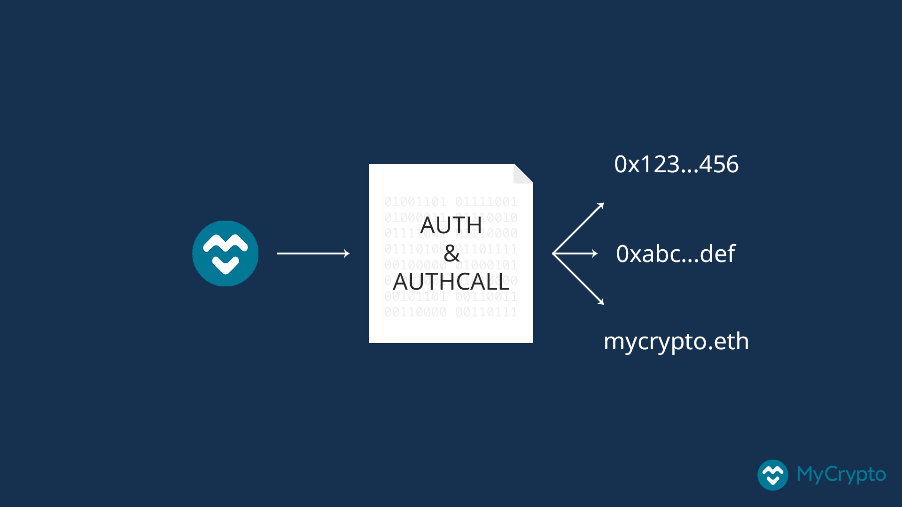
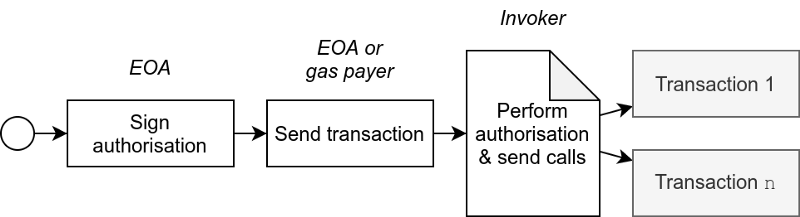
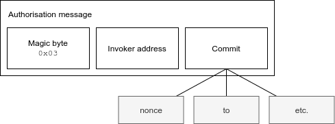

If you are active on Ethereum, chances are that you own some (ERC-20) tokens as well, e.g., for interacting with different DeFi projects in the Ethereum ecosystem. Doing this, however, [requires you to have Ether](https://support.mycrypto.com/general-knowledge/ethereum-blockchain/what-is-gas) since you cannot pay for transaction fees using tokens. Additionally, when you want to send tokens to a smart contract, you usually have to do two transactions: The first one to `approve` the contract spending your tokens, and the second one to `transferFrom` the tokens to the contract.

EIP-3074 can solve these problems, and many more, by introducing a way for smart contracts to send transactions _in the context of_ an Externally Owned Account (EOA, or simply a regular Ethereum address).

> This EIP introduces two EVM instructions `AUTH` and `AUTHCALL`. The first sets a context variable `authorized` based on an ECDSA signature. The second sends a call as the `authorized`. This essentially delegates control of the EOA to [a] smart contract.



The `AUTH` and `AUTHCALL` EVM instructions (also known as opcodes) let a smart contract authorize an EOA based on [a signed message](https://medium.com/mycrypto/the-magic-of-digital-signatures-on-ethereum-98fe184dc9c7), and send transactions ("calls") from that EOA. This opens up a lot of possibilities, like:

- **Sponsored transactions** (also known as meta transactions): Paying for the gas of a transaction from another account. This will also allow you to send tokens from an address that does not have any Ether.
- **Batched transactions**: Sending multiple transactions in a single call. This guarantees that two or more transactions are executed in the same block, and can also reduce the transaction fee.
- **Improved user experience (UX)**: You can call `approve` and `transferFrom` in a single transaction, for example.

Unlike existing solutions to these problems, EIP-3074 does not require a smart contract wallet. You can simply send a transaction to a so-called invoker which executes the transactions. Invokers are stateless, trustless smart contracts, and they don't require you to send balance to the contract beforehand. EIP-3074 also does not introduce a [new transaction type](/posts/new-transaction-types-on-ethereum). By only introducing two new EVM instructions, it should technically be easier to implement.

Unfortunately, EIP-3074 is still under review, and it's not known yet when the EIP will be activated due to different (security) concerns. If you want to experiment with it now, you can make use of the [Puxi testnet](https://github.com/quilt/puxi). In this article, I'll give a detailed explanation of how EIP-3074 works.

If you want to see EIP-3074 in action, I made an example (batch) transaction invoker contract, which you can find here:

<Embed title="Mrtenz/transaction-invoker"
description="EIP-3074 (Batch) transaction invoker, which can send multiple transactions in a single call"
url="https://github.com/Mrtenz/transaction-invoker"
image="https://avatars2.githubusercontent.com/u/7503723" />

Note that this contract is not audited, and is only a proof of concept. You should not use this in production environments.

## The AUTH and AUTHCALL opcodes

EIP-3074 defines two new opcodes, which can be called from a smart contract:

- `AUTH` (`0xf6`)—Authorises an Externally Owned Account based on a signature and _commit_. It takes four input parameters: `commit` and the signature's `yParity`, `r`, and `s`.
- `AUTHCALL` (`0xf7`)—Sends calls (transactions) in the context of the authorised EOA. It takes eight input parameters: `gas`, `addr`, `value`, `valueExt`, `argsOffset`, `argsLength`, `retOffset`, `retLength`. This is similar to the existing CALL opcode.

In order to authorise an EOA, you need a signed message from that EOA. The smart contract calling `AUTH` can recover the signer from the message signature, which is then set as the `authorized` EVM context variable. Now, whenever the smart contract calls `AUTHCALL`, the caller is set to the `authorized` address. When the called smart contract calls `CALLER` (e.g., through Solidity's `msg.sender`), this is now the address of the authorised EOA, rather than the address of the invoker, the smart contract performing the call.

A basic flow to send one or more transactions looks like this:



1. The EOA signs the authorisation message;
2. The EOA or another _gas payer_ sends the transaction data and authorisation message to the invoker contract;
3. The invoker contract performs authorisation using `AUTH`, and sends the transactions using `AUTHCALL`.

It does not matter who sends the transaction to the contract, as long as the signature of the EOA is valid. This makes it possible for someone else (or another account) to send the transaction.

Note that it's currently not possible to send Ether from an EOA using EIP-3074. Doing this would significantly change important assumptions that are made currently, like checking if a transaction is valid. Instead, it's taken from the invoker's own Ether balance. You can still send Ether to the invoker and have the invoker forward that, however. The `AUTHCALL` opcode includes a field `valueExt`, which currently needs to be hardcoded as 0. In the future, this can be changed to allow an invoker to send Ether from an EOA if a proper solution is found for the concerns.

### The authorisation message and commit

To perform authorisation, an EOA must sign a message with a specific format:

```text
0x03 || <Padded invoker address> || <Commit>
```

<p>
<sup>(Note: <inlineCode>||</inlineCode> is used as byte concatenation operator).</sup>
</p>

It consists of three parts: a magic byte (`0x03`), the invoker address (address of the smart contract that will perform the authorisation) padded to 32 bytes, and a 32 byte commit.



The commit describes what the EOA commits to and can be calculated based on certain properties of the call, such as a hash of the address, value, and nonce. The invoker contract can re-calculate the commit based on the provided properties and perform the authorisation if these fields are correct.

For example, let's say we want to send the following transactions (represented as JSON):

```json
[
  {
    "to": "0x6b175474e89094c44da98b954eedeac495271d0f",
    "value": 123,
    "nonce": 0
  },
  {
    "to": "0x4bbeEB066eD09B7AEd07bF39EEe0460DFa261520",
    "value": 123,
    "nonce": 1
  }
]
```

We can hash these fields (e.g., by concatenating them together in a deterministic way, or by using something like [EIP-712](https://eips.ethereum.org/EIPS/eip-712)) and use that as commit.

We can provide both the transactions to send and the signature of the authorisation message in a smart contract, as displayed in this JSON data. The contract function can look something like this for example:

```solidity
function sendTransactions(Transaction[] calldata transactions, Signature calldata signature) external;
```

The smart contract re-calculates the commit based on the `transactions`, and provides this—together with the signature—to the `AUTH` call. This will attempt to recover the address of the signer, and if the commit is invalid, the wrong address will be recovered from the signature, meaning that the transaction will fail.

The invoker is fully responsible for making sure that this commit is secure. You could simply sign a message with `0x0` as commit, and give a smart contract full access to the EOA. Previous versions of EIP-3074 included a more strict format for the commit, including things like replay protection, but this was later removed to allow for more flexibility. For this reason, it's important that you trust the invoker you are interacting with.

## Limitations and security concerns

EIP-3074 significantly changes how the EVM works by being able to change the `CALLER` based on a signature. This can introduce potential vulnerabilities in both new and existing contracts. For this reason, [EIP-3074 was formally audited](https://notes.ethereum.org/@djrtwo/eip-3074-audit-rfp).

Some of the possible security concerns are explained below. For these different reasons, EIP-3074 recommends only interacting with trusted invokers. Wallet interfaces like [MyCrypto](https://mycrypto.com/) can implement a trusted invoker whitelist, to only allow you to sign an authorisation message for certain invokers, for example.

### Weak commits and replay attacks

As explained above, EIP-3074 does not define a standardised format for the commit. Invokers are free to implement this in any way they want. This means that the invoker is fully responsible for providing sufficient protection from, for example, replay attacks.

If the commit does not include some kind of nonce, someone could simply take the signed message and send it to the invoker again. Malicious invokers could gain control over an EOA by simply not validating the commit at all. You should always be careful when signing messages.

EIP-3074 has basic protection against replay attacks by including the address of the invoker in the authorisation message. This way it's not possible to replay an authorisation message for one invoker on another invoker.

### Upgradeable invokers

EIP-3074 explicitly states that invokers must not be upgradeable. If an invoker were upgradeable, someone could deploy another version of the invoker which does not verify the commit, giving the contract full control of an EOA.

### Re-entrancy attacks

Currently, smart contracts can use `require(tx.origin == msg.sender)`, which checks if a transaction is sent from an EOA (rather than another contract). This allows for simple re-entrancy prevention, since it prevents contracts from calling the function.

EIP-3074 allows `tx.origin` to be the signer of the authorisation message as well. Any `AUTHCALL`s performed by the invoker would then result in `tx.origin == msg.sender` being true, even though the call was performed by a smart contract, thus possibly introducing re-entrancy attacks. EIP-3074 mentions the following: "[…] the authors of this EIP did not find any examples of this form of re-entrancy protection, though the search was non-exhaustive."

## Conclusion

EIP-3074 brings a lot of exciting new possibilities to Ethereum. `AUTH` and `AUTHCALL` allow an EOA to delegate control of the account to a smart contract invoker, making it possible to send batch transactions, sponsored transactions, etc. It comes with some significant changes to how transactions work on Ethereum however, so some more thought on security is needed before EIP-3074 can be activated on the mainnet.
